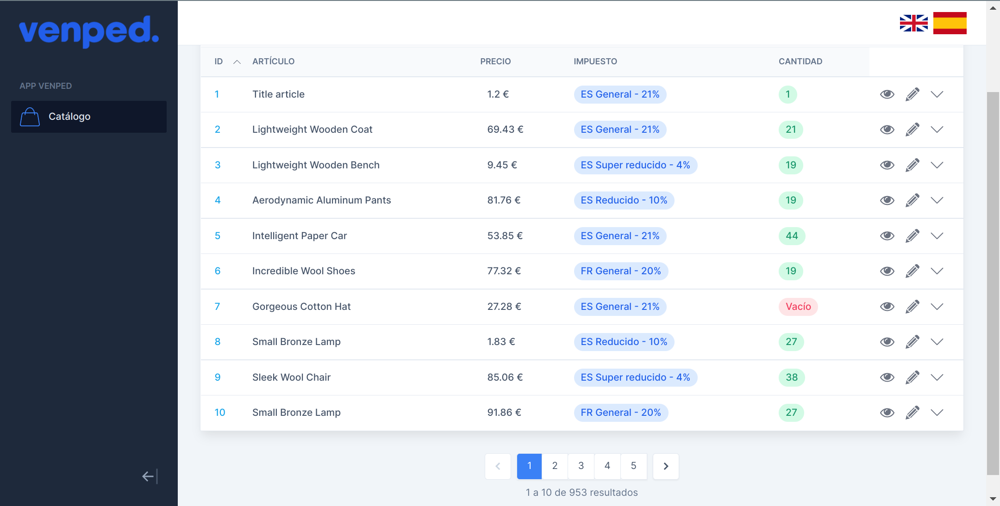

# Frontend Challenge Venped

La prueba consiste en conectar y mostrar correctamente datos obtenidos mediante GraphQL desde un servidor de pruebas y algunas funcionalidades básicas adicionales.

## Resultado final 🏁



## Detalles 📋
  - Frontend realizado con React y maquetado con [tailwindcss](https://tailwindcss.com/docs/installation).
  - Llamadas al servidor realizadas con [GraphQL](https://graphql.org/).
  - Filtros para las llamadas al servidor.
  - Cambio de lenguaje implementado con [i18n](https://www.i18next.com/overview/getting-started).
  - Posibilidad de cambiar los colores principales de la aplicación sin tener que modificar el código.
  - Tests básicos realizado con [jest](https://jestjs.io/docs/getting-started).

## Ejecución :star:
  
Una vez descargado el repositorio:

  - Instalar todas las dependencias
  
    ```
    npm install
    ```
    
  - Ejecutar la aplicación web en modo desarrollo
  
    ```
    npm run dev
    ```
  - Ejecutar los test de la aplicación web
  
    ```
      npm run test
    ```
    
**Importante: La URL para obtener los productos no se encuentra en el código. Está implementada como variable de entorno**

## Autor ✒️
**Jesús Martín Zorrilla** - *Trabajo Inicial y Documentación*

- [Portafolio](https://jesusmarzor.com)
- [Linkedin](https://www.linkedin.com/in/jesusmarzor/)

## Licencia 📄
Este proyecto está bajo la Licencia (GNU General Public License v3.0) - mira el archivo [LICENSE](LICENSE) para detalles
